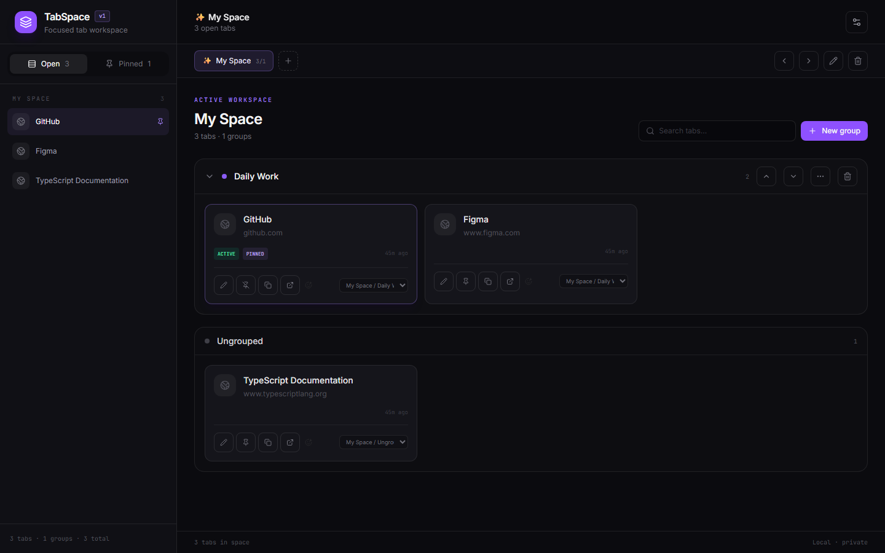

# TabSpace

TabSpace is a privacy-conscious Chrome extension for organizing open and saved tabs into persistent spaces and groups. It provides a full-page dashboard, real Chrome tab controls, portable backups, compatible exports, and optional private GitHub Gist synchronization.



## Features

- Discover and reconcile open Chrome tabs without duplicates
- Activate, close, pin, search, alias, and add emoji avatars to tabs
- Create, rename, recolor, reorder, and safely delete spaces and groups
- Use Ctrl/Cmd/Shift selection and move multiple tabs at once
- Import explicitly selected Toby, Tabme, or TabSpace JSON
- Merge imports or atomically replace organization after confirmation
- Export a canonical TabSpace backup, Netscape Bookmarks HTML, OneTab text, or Markdown
- Synchronize the canonical backup through a private GitHub Gist
- Keep organization local by default in `chrome.storage.local`

## Requirements

- Chrome with Manifest V3 support
- Node.js 22.12 or newer
- npm 12
- Microsoft Edge is used by the configured local Playwright test; adjust `playwright.config.ts` if another Chromium channel is required

## Development

```bash
npm install
npm run dev
```

Available commands:

| Command | Purpose |
| --- | --- |
| `npm run dev` | Start the Vite development server |
| `npm run lint` | Run ESLint |
| `npm run typecheck` | Run strict TypeScript checks |
| `npm test` | Run Vitest unit and component tests |
| `npm run test:e2e` | Run the production-dashboard Playwright workflow |
| `npm run build` | Build and verify the unpacked extension in `dist/` |
| `npm run package` | Build and create `release/tabspace-v0.1.0.zip` |
| `npm run validate` | Run lint, types, tests, build verification, and E2E |

## Install locally in Chrome

1. Run `npm install` and `npm run build`.
2. Open `chrome://extensions`.
3. Enable **Developer mode**.
4. Select **Load unpacked**.
5. Choose this repository's `dist/` directory.
6. Pin TabSpace and select its toolbar icon.

After changing source code, rebuild and select **Reload** on the TabSpace extension card.

## Usage

### Spaces and groups

New tabs enter the most recently active space as Ungrouped. The sidebar lists every currently open tab in the dashboard's Chrome window, regardless of which TabSpace space or group owns it. Drag an open sidebar tab onto a group, or onto **New group** to create a default group automatically. Tab cards can also be dragged between groups or back to Ungrouped. Use the space toolbar to create or switch spaces. Deleting a group moves its tabs to Ungrouped. Deleting a space keeps its Chrome tabs open and moves their records ungrouped to the first remaining space. The final space cannot be deleted.

### Search and tab actions

Search matches aliases, titles, domains, and URLs. Card controls activate/open, close, pin, copy, rename, change the avatar, or move a tab. Use the selection control on a card with Ctrl/Cmd or Shift for bulk movement.

### Import and export

Open **Settings → Import or export data**. Choose the provider before selecting or dropping a JSON file; TabSpace intentionally does not guess the provider.

- **Toby:** organization, account, and list-array JSON exports using collections (`lists`) and links (`cards`)
- **Tabme:** backup profile using spaces, folders/collections, and `items`; direct links and nested `groupItems` are flattened into their containing TabSpace group. See the sanitized fixture at `src/transfer/fixtures/tabme-backup.json`
- **TabSpace:** canonical `tabspace-backup.json`

Review the preview and warnings, then choose **Merge** or confirmed **Replace**. After a successful import, the dialog closes and the imported workspace appears immediately. Imported favicon URLs are sanitized and retained, with a conventional site favicon fallback. Unsupported or unsafe non-HTTP(S) tab URLs are skipped and reported. The sanitized Toby fixture is at `src/transfer/fixtures/toby-export.json`.

Exports preserve space/group hierarchy where the target format permits it. Backup and export files contain tab titles and URLs and should be treated as sensitive.

### Private GitHub Gist synchronization

1. Create a fine-grained GitHub personal access token with Gists permission.
2. Open **Settings** and enter the token in **Private GitHub Gist sync**.
3. Create a private Gist or push an update.
4. Use **Pull** to confirm and restore the remote backup.

The token is held only in `chrome.storage.session`, is cleared when disconnected or the browser session ends, and is never stored in the canonical document or export. TabSpace persists only the Gist ID, last-sync time, and revision. Conditional revisions prevent silently overwriting a changed remote Gist.

Private Gists are not end-to-end encrypted. GitHub can process their contents, including sensitive tab titles and URLs.

## Permissions

- `tabs`: discover tab metadata and perform requested activation, close, and pin actions
- `storage`: persist organization locally and hold a GitHub token for the current browser session
- `https://api.github.com/*`: create, update, and retrieve a private Gist when the user enables synchronization

TabSpace does not inject scripts into websites and does not request browsing-history permission.

## Data safety

- Runtime validation rejects malformed documents and undeclared secret fields.
- Outdated documents migrate in place.
- Invalid local documents recover to a safe `My Space` state while retaining only non-sensitive recovery metadata.
- Backups omit Chrome runtime IDs, credentials, and synchronization metadata.
- No sample Work, Research, or Personal spaces are seeded.

## Known v1 limitations

- Chrome is the only supported browser target.
- A Tabme export that differs from the documented fixture profile may require a parser update because Tabme does not publish a stable public JSON schema.
- Imported saved tabs are represented in the dashboard and open when selected; imports do not automatically open every URL.
- GitHub authentication uses a user-provided fine-grained token rather than an OAuth application.
- Cross-device synchronization occurs only when the user explicitly pushes or pulls.

## Packaging

```bash
npm run package
```

The ZIP places `manifest.json` at its root and can be inspected or submitted as a release artifact. Never commit browser profiles, tokens, exported backups, or other files containing private tab data.

## License

MIT
